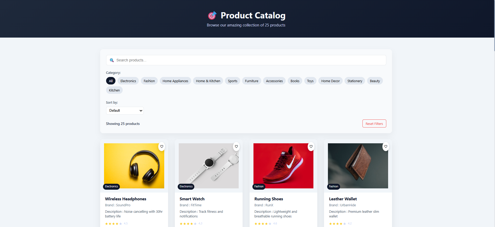
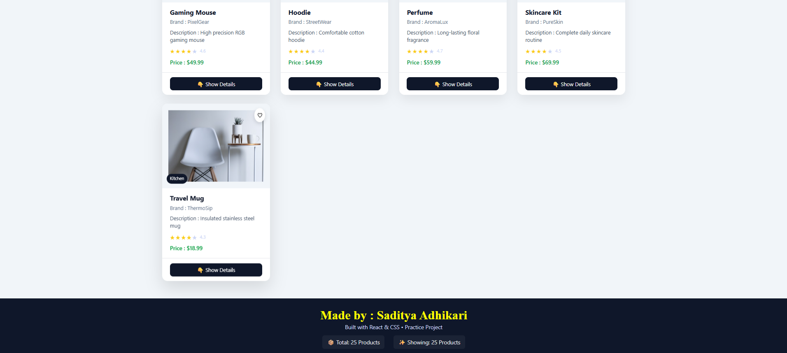
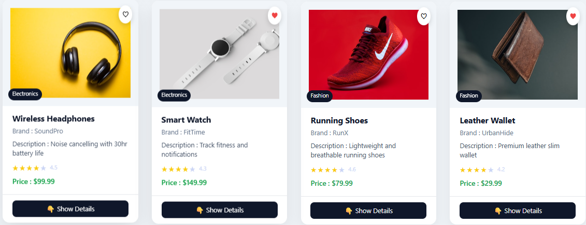

# 🛍️ Product Catalog

A **React-based Product Catalog Web App** built using **Vite**.  
Users can browse, search, filter, and sort products across multiple categories.  
Each product is displayed as a card with image, name, brand, price, and rating. Clicking a product opens a modal with full details. The app is fully responsive and supports light and dark themes.

---

## ✨ Features

- 🔍 Search products by name
- 🗂 Filter products by category with real-time updates
- ↕️ Sort products by price or rating
- 🖼️ Product cards with image, name, brand, price, rating
- ❤️ Like button for favorite products
- 📦 Expandable quick details on product cards
- 📑 Modal with full product information: stock, colors, category, description
- 🔄 Reset filters to default view
- 📱 Fully responsive design with light/dark theme support

---

## 🛠 Tech Stack

- **Frontend:** React (Functional Components & Hooks)
- **Build Tool:** Vite
- **State Management:** useState, useEffect
- **Styling:** CSS
- **Data Handling:** Dynamic rendering of product arrays, conditional rendering
- **UI Components:** Modular and reusable (Header, Footer, Filter, ProductCard, ProductModal)

---

## 🚀 Getting Started

### 1. Create the project using Vite

```bash
npm create vite@latest product-catalog
Choose React and JavaScript/TypeScript as needed

Navigate to the project folder:

cd product-catalog

2. Install dependencies
npm install

3. Start the development server
npm run dev


Open the URL shown in the terminal (usually http://localhost:5173)

📸 Screenshots:






```
